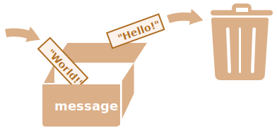

# Variables

Normalment, una aplicació de JavaScript necessita funcionar amb informació. Aquí hi ha dos exemples:
1. una botiga en línia -- la informació podria incloure productes que es venen i un carretó de la compra.
2. una aplicació de xat -- la informació pot incloure usuaris, missatges i molt més.

Les variables s'utilitzen per emmagatzemar aquesta informació.

## Una variable

Una [variable](https://ca.wikipedia.org/wiki/Variable_(programaci%C3%B3)) és un espai reservat a la memòria, amb un nom, i utilitzat per a la informació. Podem utilitzar variables per emmagatzemar dades de productes, de visitants i d'altres.

Per a crear una variable en JavaScript, utilitzeu la paraula clau "let".

L'expressió següent crea (en altres paraules: *declara* or *defineix*) una variable amb el nom "message":

```js
let message;
```

Ara, podem posar-hi algunes dades mitjançant l'operador de l'assignació `=`:

```js
let message;

*!*
message = 'Hello'; // emmagatzema la cadena
*/!*
```

La dada de tipus "string" ara es desa a l'àrea de memòria associada a la variable. Podem accedir-hi utilitzant el nom de la variable:

```js run
let message;
message = 'Hello!';

*!*
alert(message); // mostra el contingut de la variable
*/!*
```

Podem combinar la declaració de la variable i l'assignació en una sola línia:

```js run
let message = 'Hello!'; // defineix la variable i assigna el valor

alert(message); // Hello!
```

També podem declarar varies variables en una línia:

```js no-beautify
let user = 'John', age = 25, message = 'Hello';
```

Això pot semblar més fàcil, però no ho recomanem. En nom d'una millor llegibilitat, utilitzeu una sola línia per variable.

La variant multilínia és una mica més llarga, però més fàcil de llegir:

```js
let user = 'John';
let age = 25;
let message = 'Hello';
```

Hi ha persones que defineixen múltiples variables en aquest estil multilínia:

```js no-beautify
let user = 'John',
  age = 25,
  message = 'Hello';
```

...O fins i tot en l'estil "primer la coma":

```js no-beautify
let user = 'John'
  , age = 25
  , message = 'Hello';
```

Tècnicament, totes aquestes variants fan el mateix, per tant és una qüestió de gust personal i estètica.

````smart header="`var` en comptes de `let`"
En codi antic, també podeu trobar una altra paraula clau: `var` en comptes de `let`:

```js
*!*var*/!* message = 'Hello';
```

La paraula clau `var` és *gairebé* el mateix que `let`. També declara una variable, però de manera diferent, una manera mes antiga.

Hi ha diferències subtils entre `let` i `var`, però en aquest moment no hi entrarem. Els explicarem detalladament al capítol <info:var>.
````

## Una analogia real

Podem entendre fàcilment el concepte de "variable" si l'imaginem com una "caixa" per a les dades, amb una etiqueta amb un nom únic.

Per exemple, la variable `message` la podem imaginar com una caixa etiquetada `"message"` amb el valor `"Hello!"` dins:


Podem posar qualsevol valor a la caixa.

També podem canviar el valor tantes vegades com vulguem:
```js run
let message;

message = 'Hello!';

message = 'World!'; // valor canviat

alert(message);
```

Quan es canvia el valor, el valor anterior s'elimina de la variable:



També podem declarar dues variables i copiar dades d'una a l'altra.

```js run
let hello = 'Hello world!';

let message;

*!*
// copia 'Hello world' de la variable hello a la  variable missatge
message = hello;
*/!*

// ara dues variables tenen les mateixes dades
alert(hello); // Hello world!
alert(message); // Hello world!
```

```smart header="Llenguatges funcionals"
És interessant observar que existeixen llenguatges de programació [functional](https://ca.wikipedia.org/wiki/Programaci%C3%B3_funcional), com [Scala](http://www.scala-lang.org/) o [Erlang](http://www.erlang.org/) que no permeten canviar els valors de les variables.

En aquests llenguatges, una vegada que el valor és a la"caixa", és allà per sempre. Si cal posar-hi un altre valor, el llenguatge ens obliga a crear una nova "caixa" (declarar una nova variable).No podem reutilitzar la mateixa.

Encara que pot semblar una mica estrany a primera vista, aquests llenguatges són molt capaços de un desenvolupament seriós. Encara més, hi ha àrees com càlculs paral·lels on aquesta limitació confereix certs beneficis. Estudiar aquests llenguatges (encara que no es tingui la intenció d'utilitzar-los aviat) es recomanable per a ampliar la ment.
```

## Donar noms a les variables [#variable-naming]

Hi ha dues limitacions quant als noms de les variables en JavaScript:

1. El nom només pot contenir lletres, dígits o els símbols `$` i `_`.
2. El primer caràcter no pot ser un dígit.

Examples de noms valids:

```js
let userName;
let test123;
```

Quan el nom conté paraules múltiples, habitualment s'utilitza [camelCase](https://ca.wikipedia.org/wiki/CamelCase). Això és:
les paraules van una darrere l'altra, cada paraula excepte la primera començant amb majúscula: `myVeryLongName`.

El que és interessant és que -- el símbols de dòlar `'$'` i el de subratllat `'_'` també es poden utilitzar en noms. Són símbols normals, com les lletres, sense significat especial.

Aquests noms són vàlids:

```js run untrusted
let $ = 1; // declara una variable amb el nom "$"
let _ = 2; // declara una variable amb el nom "_"

alert($ + _); // 3
```

Exemples de noms de variable incorrectes:

```js no-beautify
let 1a; // no es pot començar amb un dígit

let my-name; // els guionets '-' no es permeten al nom
```

```smart header="Majúscules o minúscules és important"
Les variables anomenades `apple` i `AppLE` són dues variables diferents.
```

````smart header="Es permeten caràcters no llatins, però no es recomanen"
És possible utilitzar qualsevol llenguatge, incloent-hi caràcters cil·làmiques o fins i tot jeroglífics, com aquest:

```js
let имя = '...';
let 我 = '...';
```

Tècnicament, no hi ha cap error aquí, es permeten aquests noms, però hi ha un consens internacional per utilitzar l'anglès en noms de variables. Encara que estiguem escrivint un script petit, pot tenir una vida llarga per davant. És possible que la gent d'altres països hagi de llegir-ho més endavant.
````

````warn header="Noms reservats"
Hi ha una [llista de paraules reservades](https://developer.mozilla.org/en-US/docs/Web/JavaScript/Reference/Lexical_grammar#Keywords),que no es poden utilitzar com a noms de variable perquè són 
utilitzades pel llenguatge.

Per example: `let`, `class`, `return`, i `function` estan reservades.

El script següent dóna un error de sintaxi:

```js run no-beautify
let let = 5; // no es pot anomenar una variable "let", error!
let return = 5; // tampoc no es pot anomenar "return", error!
```
````

````warn header="Una assignació sense `use strict`"

Normalment, hem de definir una variable abans d'utilitzar-la. Però temps enrere, era tècnicament possible crear una variable mitjançant una mera assignació del valor sense utilitzar `let`. 
Això encara funciona si no posem `use strict` als nostre script per mantenir la compatibilitat amb scripts antics.

```js run no-strict
// sense: no "use strict" en aquest exemple

num = 5; // la variable "num" es crea si no existeix

alert(num); // 5
```

És una mala pràctica i causaria un error en mode estricte (use strict).:

```js
"use strict";

*!*
num = 5; // error: num no està definit
*/!*
```
````

## Constants

Per declarar una variable constant (no es pot canviar), utilitzeu `const` en lloc de :`let`:

```js
const myBirthday = '18.04.1982';
```

Les variables declarades utilitzant `const` s'anomenen "constants". No es poden canviar. Intentar fer-ho provocaria un error:

```js run
const myBirthday = '18.04.1982';

myBirthday = '01.01.2001'; // error, no es pot reassignar la constant!
```

Quan un programador o programadora està segur que una variable mai canviarà, la pot declarar amb `const` per garantir i comunicar clarament aquest fet a tothom.


### Constants en majúscules

Hi ha una pràctica generalitzada d'utilitzar constants com a àlies per a valors difícils de recordar que es coneixen abans de l'execució.

Aquestes constants s'anomenen utilitzant lletres majúscules i guions baixos (subratllat).

Per exemple, fem constants per als colors en el format anomenat "web" (hexadecimal):

```js run
const COLOR_RED = "#F00";
const COLOR_GREEN = "#0F0";
const COLOR_BLUE = "#00F";
const COLOR_ORANGE = "#FF7F00";

// ...quan calgui triar un color
let color = COLOR_ORANGE;
alert(color); // #FF7F00
```

Beneficis:

- `COLOR_ORANGE` és molt més fàcil de recordar que `"#FF7F00"`.
- És molt més fàcil escriure `"#FF7F00"` malament  que `COLOR_ORANGE`.
- llegir `COLOR_ORANGE` té molt més significat que `#FF7F00`.

Quan hauríem d'utilitzar majúscules per a una constant i quan hauríem de nomenar-les normalment (camelCase)? Deixem-ho clar.

Ser una "constant" vol die que el valor d'una variable no canvia mai. Però hi ha constants que es coneixen abans de l'execució (com un valor hexadecimal per al vermell) i hi ha constants calculades en execució, però no canvien després de la seva assignació inicial.

Per example:
```js
const pageLoadTime = /* temps d'una pàgina web per carregar */;
```

El valor de `pageLoadTime` no es coneix abans de carregar la pàgina, així que s'anomena normalment (camelCase). Però és una constant perquè no canvia després de l'assignació.

En altres paraules, les constants en majúscules només s'utilitzen com àlies per a valors "codificats".  

## Anomenar correctament

Parlant de variables, hi ha una altra cosa molt important.

Un nom de variable ha de tenir un significat net i obvi, i descriure la dada del seus possibles valors.

Nomenar les variables és una de les habilitats més importants i complexes en la programació. Un ràpid cop d'ull als noms de les variables pot revelar si el codi va ser escrit per un principiant o un programador experimentat.

En un projecte real, la major part del temps es dedica a modificar i estendre una base de codi existent en lloc d'escriure una cosa completament nova. Quan tornem a un codi després de fer una altra cosa durant un temps, és molt més fàcil trobar informació amb noms correctes i clars. O, en altres paraules, quan les variables tenen bons noms.

Pensa bé el nom de les variable abans de declarar-les. 

Algunes bones regles:

- Utilitza noms llegibles com `.userName`. o `.shoppingCart`..
- No utilitzes abreviatures o noms curts com `a`, `b`, `c`, excepte quan sigui necessari.
- Tria noms descriptius i concisos. Exemples de noms erronis són `data` i `value`. Aquests noms no diuen res. Només està bé utilitzar-los si el context del codi fa que sigui obvi a quines dades o valor es refereix la variable .
- poseu-vos d'acord en el vostre equip, o amb tu mateix, per a tenir un estàndard. Si un visitant de la web s'anomena ".user", llavors hauríem de nomenar les variables relacionades `.currentUser` o `.newUser`. en comptes de `.currentVisitor`. o `.newManIntown`

Sona senzill? De fet ho és, però la creació de noms de variable descriptius i concisos en la pràctica no ho és. 

```smart header="Reutilitzar o crear?"
I l'última nota. Hi ha alguns programadors que, en lloc de declarar noves variables, tendeixen a reutilitzar les existents.

Com a resultat, les seves variables són com caixes en les quals la gent llança coses diferents sense canviar les etiquetes. 
Què hi ha ara dins de la caixa? Qui sap? Hem d'acostar-nos i comprovar-ho.

Aquests programadors estalvien una mica en la declaració de variable, però perden deu vegades més en la depuració.

Una variable addicional és bona, no dolenta.

Els "minifiers" i navegadors moderns amb JavaScript optimitzen els scripts prou bé, així que no creen problemes de rendiment. L'ús de variables diferents per a valors diferents pot fins i tot ajudar el navegador a optimitzar el vostres scripts.
```

## Resum

Podem declarar variables per emmagatzemar dades utilitzant les paraules clau .var., .let. o .const.

- `let` -- és una declaració de variable més recent. Els scripts han d'estar en mode estricte (use strict) per utilitzar "let" amb Chrome (V8).
- `var` -- és una declaració de variable tradicional. Normalment no l'utilitzem, però cobrirem diferències amb "let" al capítol <info:var>, només per si de cas.
- `const` -- és com "let", però el valor de la variable no es pot canviar.

Les variables han de ser anomenades de manera que ens permetin entendre fàcilment què hi ha dins.
